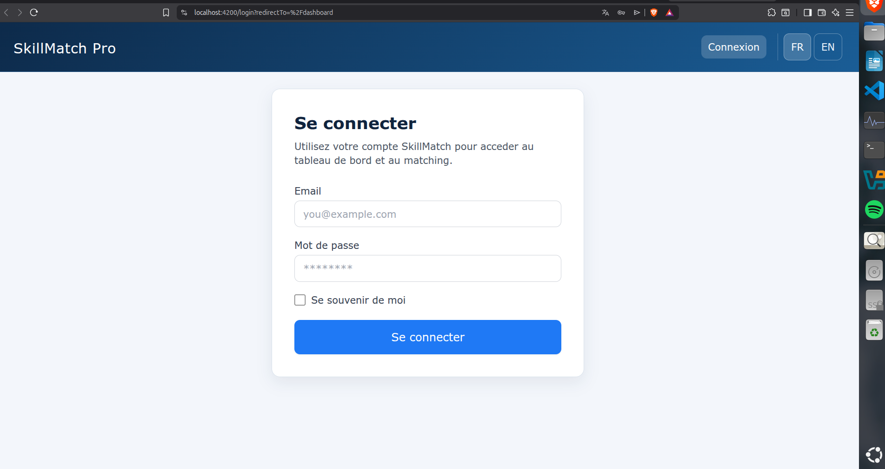
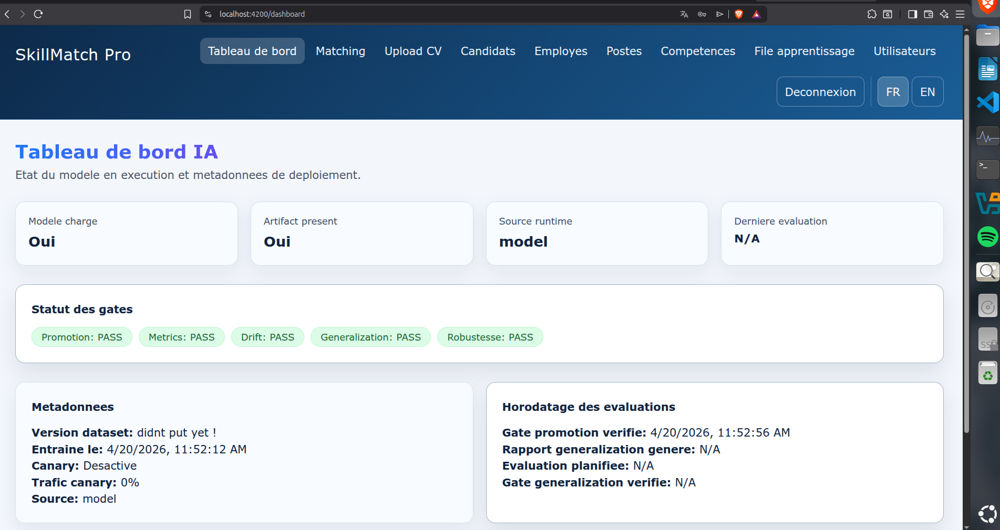
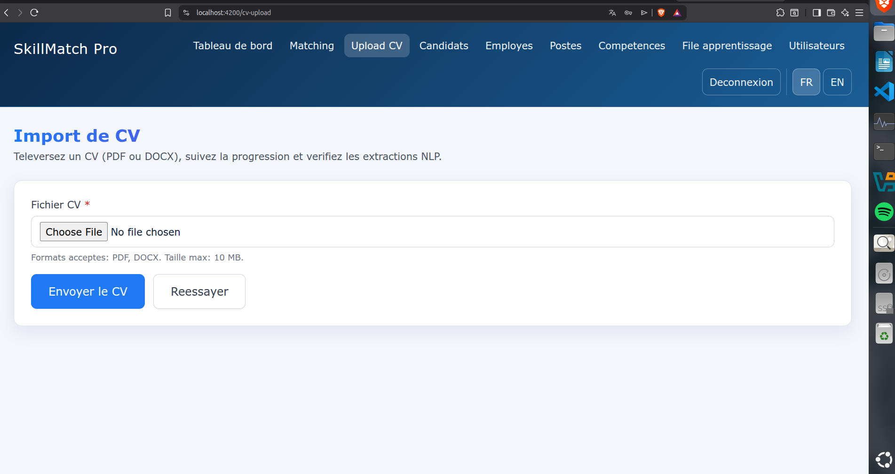
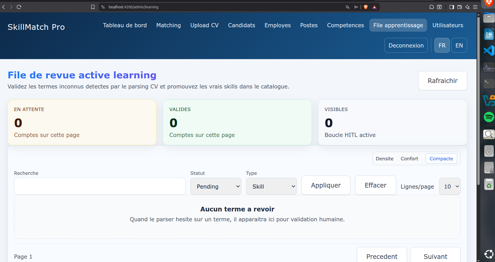
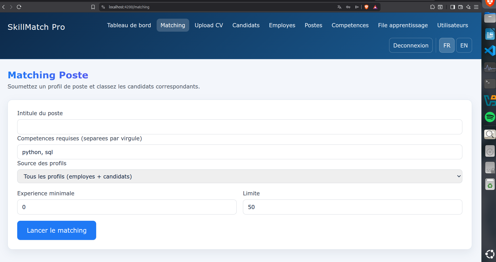
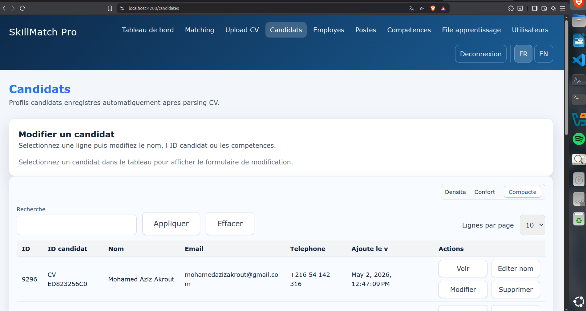
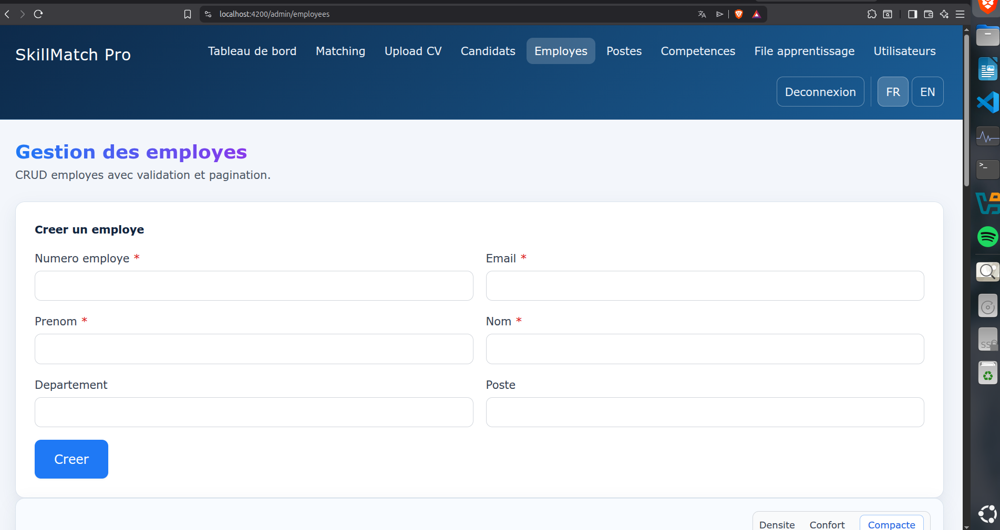
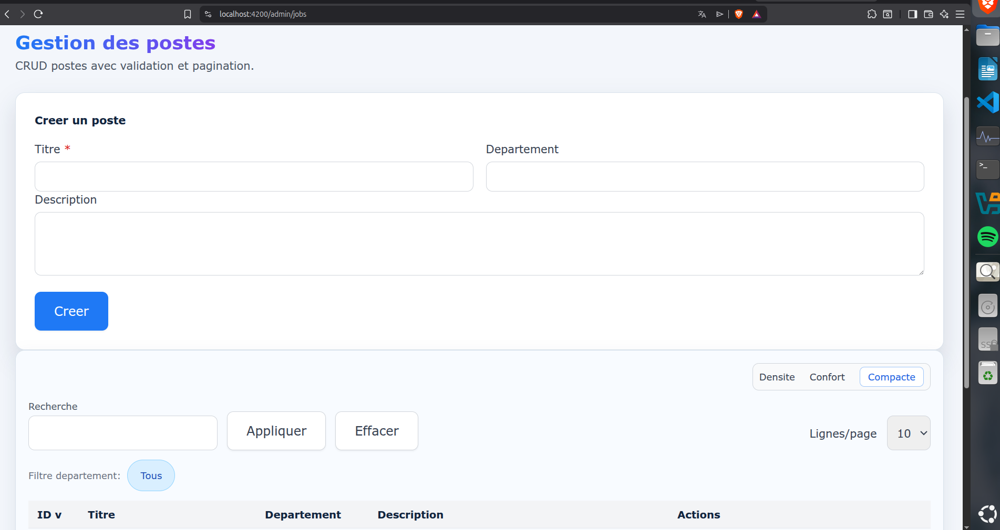
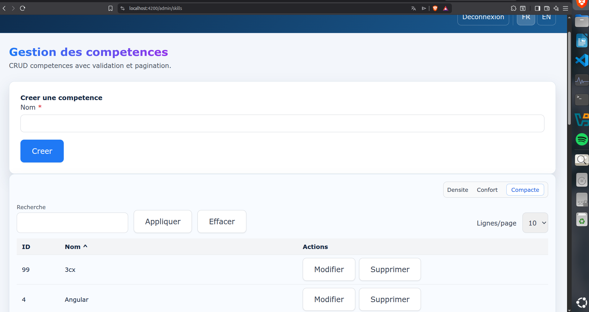
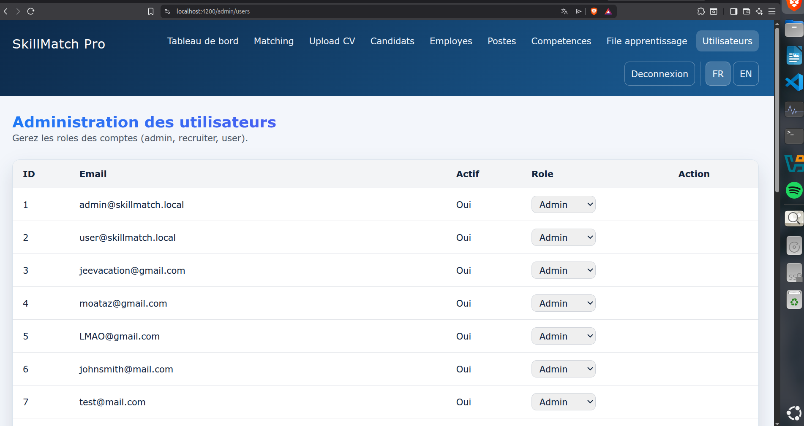

# SkillMatch Pro — Frontend

Angular single-page application for SkillMatch Pro, an internal-mobility platform that matches employees to internal job postings using a fine-tuned NLP model and an ML-based ranker.

This SPA is the user interface on top of the [SkillMatch Pro backend](../skillmatch-pro-back/README.md) (FastAPI).

## Highlights

- **Angular 21 + TypeScript** (strict mode, no `any`)
- **Bilingual UI (FR / EN)** — language switcher in the topbar, persisted across sessions
- **JWT authentication** with auto-refresh, route guards (auth + admin), and HTTP error interceptor
- **Dashboard** with current-runtime model status and deployment metadata (model version, source, F1 / precision / recall, drift indicators)
- **CV upload + extraction view** showing structured NLP output (skills, certifications, projects, languages, contact info, predicted title and experience)
- **Active-learning queue** (HITL) where admins review, approve, or reject low-confidence entities and promote terms to the canonical skill catalog
- **Candidate–job matching UI** with score breakdown (skill overlap, title alignment, experience, performance) and per-candidate training recommendations
- **Full CRUD pages** for employees, job posts, departments, skills, and users (RBAC-aware)

## Navigation

The main top navigation bar exposes the following pages:

| Page | Route | Description |
|---|---|---|
| Tableau de bord | `/dashboard` | Runtime model status + deployment metadata + activity overview |
| Matching | `/matching` | Run candidate–job matching, browse ranked results, view explanations |
| Upload CV | `/cv-upload` | Upload PDF/DOCX, view extracted entities, see HITL queue summary |
| Candidats | `/candidates` | Candidate profiles created from uploaded CVs |
| Employés | `/employees` | Employee CRUD, filters, skill assignment |
| Postes | `/jobs` | Internal job posts and required skills |
| Compétences | `/skills` | Canonical skill catalog management |
| File apprentissage | `/admin/learning` | HITL queue: review, approve, reject, promote |
| Utilisateurs | `/admin/users` | User & role management (admin only) |

## Screenshots

### Login



### Tableau de bord — runtime model status



### Upload CV — extracted entities + review summary



### File d'apprentissage — HITL review queue



### Matching — ranked candidates with score breakdown



### Candidats — list of profiles created from CVs



### Employés — employee CRUD + skill assignment



### Postes — internal job posts



### Compétences — canonical skill catalog



### Utilisateurs — user and role management



## Architecture

```
src/app/
├── app.ts / app.html / app.css     # Shell layout (topbar, language switcher, logout)
├── app.config.ts                   # Providers (zone change detection, router, http, interceptors)
├── app.routes.ts                   # Route table with guards
├── core/
│   ├── guards/                     # auth.guard, admin.guard, guest.guard
│   ├── interceptors/               # auth.interceptor (JWT), error.interceptor (toast on 4xx/5xx)
│   ├── i18n/                       # translations.ts, i18n.service.ts, t.pipe.ts
│   └── services/                   # *-api.service.ts (one per backend module)
└── pages/                          # one folder per top-level route
    ├── login/
    ├── dashboard/
    ├── matching/
    ├── cv-upload/
    ├── candidates/
    ├── employees/
    ├── jobs/
    ├── skills/
    ├── admin/
    │   ├── learning/               # HITL queue
    │   └── users/
    └── ...
```

## Development server

```bash
npm install
npm start
```

The app serves at `http://localhost:4200/` and reloads on save.

## Environment configurations

The app supports environment-specific API base URLs:

- `src/environments/environment.development.ts`
- `src/environments/environment.staging.ts`
- `src/environments/environment.production.ts`

Build by target:

```bash
npm run build:dev
npm run build:stage
npm run build:prod
```

## Production build with safety checks

```bash
npm run build:prod:check
```

Checks include:
- no hardcoded localhost API URL in built assets
- no source maps in production output

## Testing

Unit tests (Vitest):
```bash
npm run test:unit
```

End-to-end smoke tests (Playwright — login → dashboard → matching):
```bash
npm run e2e
```

Environment variables for e2e:
- `E2E_BASE_URL` (default: `https://127.0.0.1:4200`)
- `E2E_API_URL` (default: `https://127.0.0.1:8000`)
- `E2E_PASSWORD` (default: `SmokePass123!`)

## Code scaffolding

```bash
ng generate component component-name
ng generate --help
```

## Building

```bash
ng build
```

Produces optimized output under `dist/`.

## Additional resources

- Angular CLI reference: <https://angular.dev/tools/cli>
- Backend API docs (Swagger): `https://127.0.0.1:8000/docs` when the FastAPI service is running
